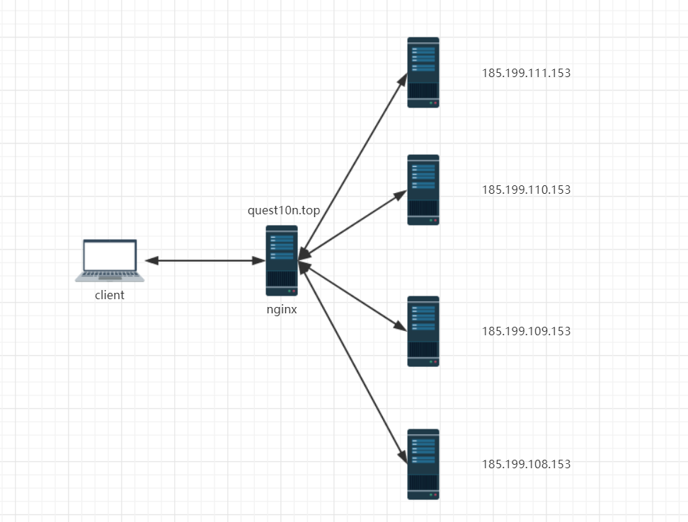

nginx： http服务器、反向代理服务器、IMAP、POP3、SMTP代理服务器

代理 代理角色 目标角色

正向代理：跳转访问、缓存服务器、授权认证、隐藏信息

反向代理隐藏了服务器信息 保证内网安全、 负载均衡


正向代理的client和proxy是一个lan，隐藏客户端信息


反向代理的server和proxy是一个lan，隐藏服务端信息




### nginx负载均衡调度算法：

weight（defaul）：根据权重分配被请求的几率
ip_hash： 固定ip访问同一个后端服务器
fair（需安装upstream_fair模块）： 根据响应时间和处理效率分配
url_hash： 根据url的hash分配


- cgi和fastcgi(fcgi)
> cgi执行动态请求是 fork-and-execute 模式，每次请求都要新开进程，效率较低
> fcig不会退出这个进程，但这样fcgi就会占用越来越多的内存，web服务器中的PHP_FCGI_MAX_REQUEST 的值是php的fcgi最大缓存值，达到最大缓存值，进程占用的内存会被全部释放。

### nginx的配置

反向代理配置（应放在http块中）：
```
upstream test {
	server xxx.xxx.xxx.xxx:端口号 weight=1;
	server xxx.xxx.xxx.xxx:端口号 weight=1;
}

server {
	listen 80;
	server name test;
	location{
		proxy_pass http://test;
	index index.html index.php; 
	}
}
```

网上找的一个，如下：
```
upstream tomcatserver1 {  
    server 192.168.72.49:8081;  
    }  
upstream tomcatserver2 {  
    server 192.168.72.49:8082;  
    }  
server {  
        listen       80;  
        server_name  8081.max.com;  
  
        #charset koi8-r;  
  
        #access_log  logs/host.access.log  main;  
  
        location / {  
            proxy_pass   http://tomcatserver1;  
            index  index.html index.htm;  
        }       
    }  
server {  
        listen       80;  
        server_name  8082.max.com;  
  
        #charset koi8-r;  
  
        #access_log  logs/host.access.log  main;  
  
        location / {  
            proxy_pass   http://tomcatserver2;  
            index  index.html index.htm;  
        }          
    }  
```
请求 8081.max.com ,访问到192.168.72.49:8081，请求8082.max.com，访问到192.168.72.49:8082。


> 以下内容参(抄)考(袭)https://www.cnblogs.com/knowledgesea/p/5175711.html

关于每个配置块的解释：
1、全局块：配置影响nginx全局的指令。一般有运行nginx服务器的用户组，nginx进程pid存放路径，日志存放路径，配置文件引入，允许生成worker process数等。

2、events块：配置影响nginx服务器或与用户的网络连接。有每个进程的最大连接数，选取哪种事件驱动模型处理连接请求，是否允许同时接受多个网路连接，开启多个网络连接序列化等。

3、http块：可以嵌套多个server，配置代理，缓存，日志定义等绝大多数功能和第三方模块的配置。如文件引入，mime-type定义，日志自定义，是否使用sendfile传输文件，连接超时时间，单连接请求数等。

4、server块：配置虚拟主机的相关参数，一个http中可以有多个server。

5、location块：配置请求的路由，以及各种页面的处理情况。

配置文件解释：
```
########### 每个指令必须有分号结束。#################
#user administrator administrators;  #配置用户或者组，默认为nobody nobody。
#worker_processes 2;  #允许生成的进程数，默认为1
#pid /nginx/pid/nginx.pid;   #指定nginx进程运行文件存放地址
error_log log/error.log debug;  #制定日志路径，级别。这个设置可以放入全局块，http块，server块，级别以此为：debug|info|notice|warn|error|crit|alert|emerg
events {
    accept_mutex on;   #设置网路连接序列化，防止惊群现象发生，默认为on
    multi_accept on;  #设置一个进程是否同时接受多个网络连接，默认为off
    #use epoll;      #事件驱动模型，select|poll|kqueue|epoll|resig|/dev/poll|eventport
    worker_connections  1024;    #最大连接数，默认为512
}
http {
    include       mime.types;   #文件扩展名与文件类型映射表
    default_type  application/octet-stream; #默认文件类型，默认为text/plain
    #access_log off; #取消服务日志    
    log_format myFormat '$remote_addr–$remote_user [$time_local] $request $status $body_bytes_sent $http_referer $http_user_agent $http_x_forwarded_for'; #自定义格式
    access_log log/access.log myFormat;  #combined为日志格式的默认值
    sendfile on;   #允许sendfile方式传输文件，默认为off，可以在http块，server块，location块。
    sendfile_max_chunk 100k;  #每个进程每次调用传输数量不能大于设定的值，默认为0，即不设上限。
    keepalive_timeout 65;  #连接超时时间，默认为75s，可以在http，server，location块。

    upstream mysvr {   
      server 127.0.0.1:7878;
      server 192.168.10.121:3333 backup;  #热备
    }
    error_page 404 https://www.baidu.com; #错误页
    server {
        keepalive_requests 120; #单连接请求上限次数。
        listen       4545;   #监听端口
        server_name  127.0.0.1;   #监听地址       
        location  ~*^.+$ {       #请求的url过滤，正则匹配，~为区分大小写，~*为不区分大小写。
           #root path;  #根目录
           #index vv.txt;  #设置默认页
           proxy_pass  http://mysvr;  #请求转向mysvr 定义的服务器列表
           deny 127.0.0.1;  #拒绝的ip
           allow 172.18.5.54; #允许的ip           
        } 
    }
} 
```